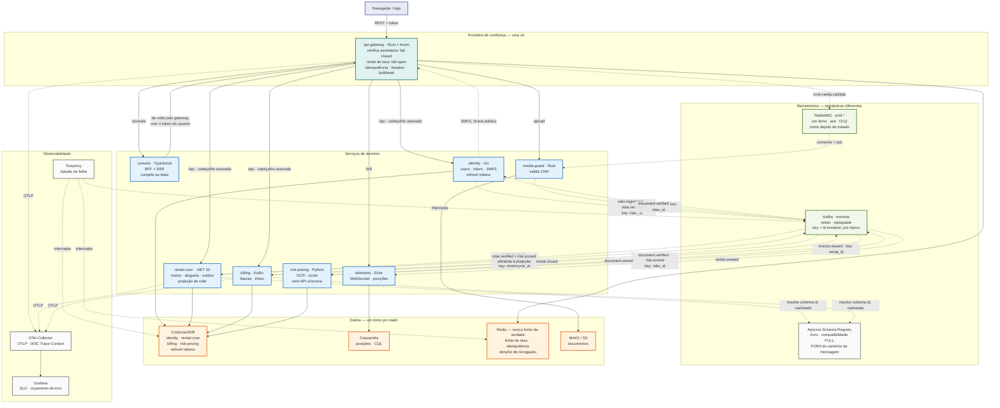

# ProjectY — arquitetura alvo, resumo das decisões

- **Status:** proposta. O que já foi implementado está marcado como tal; o resto é plano.
- **Data:** 2026-09-01
- **Escopo:** consolida a análise "Dois Sistemas, Um Repositório" e as decisões
  registradas nos ADRs 0014 a 0017.

Este documento é um índice com contexto. Cada decisão de peso vive num ADR
próprio — aqui está o porquê de cada uma, em uma parágrafo, com o link.

---

## 1. O problema que originou tudo

O repositório tinha duas realidades desconectadas: uma aplicação .NET que
funciona (quatro serviços, contra Postgres e MongoDB) e uma plataforma moderna
declarada mas vazia — catorze contêineres de infraestrutura subindo e seis
serviços de aplicação que não existiam. A estratégia é **evolução em pisos**,
não reescrita: primeiro eliminar contradições documentais, depois ligar os dois
lados, e só então mexer no modelo de dados.

---

## 2. Topologia alvo — 8 serviços, 7 linguagens

Cada linguagem entra por um workload que a obriga ([ADR 0001](adr/0001-polyglot-technology-choices.md)).

| Serviço | Linguagem | Responsabilidade | Estado |
|---|---|---|---|
| **api-gateway** | Rust (Axum) | Fronteira de confiança: verifica JWT, limita taxa, idempotência, breaker, bulkhead | Redis (só efêmero) |
| **console** | TypeScript | BFF + SSR — **compõe as telas** | nenhum |
| **identity** | Go | users, riders, JWKS, refresh tokens | CockroachDB |
| **rental-core** | .NET 10 | motos + aluguéis + outbox + projeção de rider | CockroachDB |
| **billing** | Kotlin | faturas, inbox, consome `rental.closed` | CockroachDB |
| **media-guard** | Rust | validação e guarda de CNH | MinIO / S3 |
| **risk-pricing** | Python | OCR e score de fraude — **sem API síncrona** | CockroachDB |
| **telemetry** | Elixir | WebSocket de rastreamento | Cassandra |

Sete linguagens em oito serviços é muito, e o custo é real: sete cadeias de
suprimento para manter. O que impede o zoológico é cada uma ter um ADR que a
justifica. Se for para cortar uma, o candidato é `media-guard` — dobra Rust, e
parsing de imagem cabe no gateway ou como tarefa do `risk-pricing`.

---

## 3. O desenho

Três coisas que este desenho corrige em relação ao rascunho anterior, e que
valem ser ditas em voz alta:

- **O Schema Registry não fica entre o produtor e o Kafka.** O produtor resolve
  o id do schema uma vez, cacheia, serializa localmente e publica direto. O
  registry não é SPOF de publicação nem contribui latência.
- **O `rental-core` também consome.** Ele mantém uma projeção de rider — sem
  ela, não teria como colocar o nome do entregador num evento de um dado que não
  é dele.
- **O ciclo de verificação fecha.** `document.stored` → `risk-pricing` →
  `document.verified` → `identity` → `rider.verified` → projeção do
  `rental-core`. Só aluga para CNH verificada, e nenhuma chamada síncrona
  atravessa esse caminho.

---

## 4. Decisões, e onde elas moram

### 4.1 Portabilidade — CockroachDB dos dois lados · ✅ implementado

O núcleo transacional é CockroachDB local **e** CockroachDB Cloud na AWS. Aurora
foi considerada e rejeitada: o contêiner seria PostgreSQL e o gerenciado seria
Aurora — dois engines diferentes que concordam num protocolo, o que é uma
afirmação mais fraca que todas as outras linhas da tabela do
[ADR 0004](adr/0004-cloud-portability-by-protocol.md).

O DDL foi dividido em bootstrap por engine (`000_bootstrap.<engine>.sql`) e
schema portátil (`001_schema.sql`), e o CI aplica o mesmo arquivo ao CockroachDB
e ao PostgreSQL provando a invariante nos dois. Como os dois lados são o mesmo
engine, nada quebraria se o dialeto escorregasse — por isso a checagem precisa
ser deliberada.

### 4.2 Consistência — fusão em `rental-core`

`moto-hub` e `rental-operations` viram um serviço só, para que o aluguel e a
linha do outbox sejam gravados na **mesma transação**. É isso que torna o
[ADR 0009](adr/0009-exactly-once-effect.md) verdade em vez de desenho, e exige
tirar `rentals` do MongoDB.

**Destino do MongoDB:** sai da stack quando o Piso 2 concluir. Até lá continua
no compose, servindo o `rental-operations` atual, e é o único consumidor dele.

### 4.3 Agregação de leitura — no BFF, sem GraphQL

[ADR 0014](adr/0014-read-aggregation-at-the-bff.md). O gateway e a agregação
mudam em ritmos opostos e falham em direções opostas; um schema que costura
Rental com Rider no gateway acopla um artefato semanal à fronteira de segurança.
GraphQL foi rejeitado por ser substituto do BFF, não complemento — e o gatilho
para revisitar está escrito: um terceiro consumidor externo.

**Endpoints em lote são requisito de contrato**, não otimização: sem
`GET /riders?ids=…` o N+1 só muda de lugar.

### 4.4 Contratos de evento

[ADR 0015](adr/0015-event-contracts-and-carried-state.md). Eventos carregam
estado, com uma regra estreita: *o campo descreve o fato, ou serve um
consumidor?* Um campo carregado é **fato datado, não cache** — se o entregador
muda de nome, a fatura não muda.

Partition key **sempre por id imutável e sempre por tópico**. Nunca a placa: ela
já foi reescrita neste sistema (`CanonicalizeLegacyMotorcyclePlates`), e chave
de negócio mutável reshardaria o tópico exatamente na correção. Pelo mesmo
motivo, `rentals` agora referencia `motorcycles (id)`.

Compatibilidade **FULL** — consumidor velho sobrevive ao upgrade do produtor, e
consumidor novo consegue reprocessar o histórico. **Avro** para eventos;
Protobuf, se gRPC aparecer, é outro contrato com outro ciclo de vida.

### 4.5 Score de fraude — fora do caminho da requisição

[ADR 0016](adr/0016-risk-scoring-off-the-request-path.md). O score é
pré-computado, publicado, e lido da projeção local pelo `rental-core`. Circuit
breaker com fail-open na frente de um controle antifraude é superfície de
ataque: bastaria deixar o serviço lento para burlar a checagem. `risk-pricing`
não expõe API síncrona nenhuma.

Sinais de tempo real que projeção não pega — velocidade, repetição — são
contadores no Redis do gateway, que já está lá.

### 4.6 Sessão e revogação

[ADR 0017](adr/0017-session-lifetime-and-revocation.md). Access token de 5
minutos verificado localmente por JWKS; refresh token de 7 dias no
**CockroachDB**. Revogação leva até 5 minutos para operações comuns e é imediata
para operações de alto valor, via denylist consultada só nelas.

O invariante que isso estabelece: **o Redis nunca é fonte da verdade — só
proteção e velocidade.** Perder o Redis degrada limite de taxa e idempotência,
e não desloga ninguém.

---

## 5. Estado das contradições

| # | Contradição | Estado |
|---|---|---|
| 01 | O DDL alvo não rodava no engine que o ADR 0004 declarava | ✅ **fechada** — schema portátil, provado em CI nos dois engines |
| 02 | A garantia de reserva dupla vive no MongoDB, não no schema alvo | ⬜ **aberta** — depende da fusão do Piso 2 |
| 03 | Identidade não tem lugar no schema nem entre os serviços | ⬜ **aberta** — `identity` decidido nos ADRs 0012 e 0013; tabelas não escritas |

Nenhuma caixa é marcada por decisão tomada. Só por código que roda.

---

## 6. Roteiro

| Piso | Escopo | Tamanho | Ganho |
|---|---|---|---|
| **0** | Schema portátil, bootstrap por engine, CI nos dois | P — **feito** | Portabilidade verificável |
| **1** | Mover os .NET para `services/`, ligar na stack nova, exportar OTLP | M | Os painéis param de consultar série vazia |
| **2** | Fundir em `rental-core`, migrar `rentals` do Mongo, inbox no `billing` | G | Consistência ACID real; efeito exatamente-uma-vez comprovado |
| **3** | Serviços poliglotas restantes, com contract testing | G | Arquitetura alvo completa |

Sem estimativa em semanas de propósito: ela dependeria de disponibilidade, e um
número inventado desgasta mais do que ajuda. A ordem é o que importa — cada piso
deixa o repositório demonstrável no fim.

---

## 7. Próximos passos

1. **Piso 1.** É o que converte a plataforma de cenário em instrumento.
2. **Tabelas de identidade**, incluindo `refresh_tokens` — fecha a Contradição 03
   no schema.
3. **Contrato Avro do `rental.closed`**, com os campos que descrevem o fato, e o
   job de CI que bloqueia quebra de compatibilidade.
4. **Endpoints em lote** no `identity` e no `rental-core`, travados por contrato.
5. **Política de score ausente**: qual faixa recebe um entregador ainda não
   pontuado.

---

*Deriva da análise "Dois Sistemas, Um Repositório", dos ADRs 0001–0017 e de
[`AUDITORIA-ARQUITETURA-SEGURANCA.md`](AUDITORIA-ARQUITETURA-SEGURANCA.md).*
