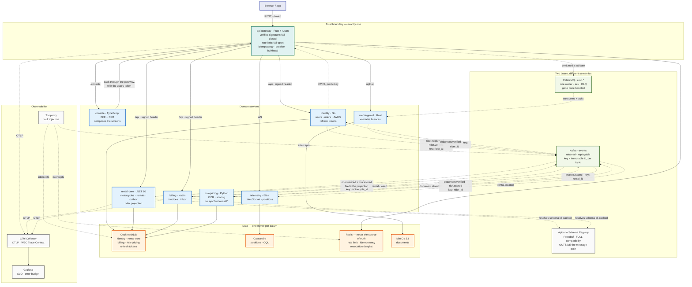

# ProjectY — the target architecture, and the decisions behind it

- **Status:** proposal. What is already implemented is marked as such; the rest is plan.
- **Date:** 2026-09-01
- **Scope:** consolidates the "two systems, one repository" analysis and the decisions recorded in ADRs 0014 to 0017.

This is an index with context. Every decision of weight lives in its own ADR —
what is here is why each one went the way it did, in a paragraph, with the link.

---

## 1. The problem that started it

The repository held two disconnected realities: a .NET application that works
(four services, against Postgres and MongoDB) and a modern platform that was
declared but empty — fourteen infrastructure containers coming up correctly, and
six application services that did not exist. The strategy is **evolution in
floors**, not a rewrite: eliminate the contradictions in the documents first,
connect the two halves next, and only then touch the data model.

---

## 2. Target topology — 8 services, 7 languages

Each language enters through a workload that forces it ([ADR 0001](adr/0001-polyglot-technology-choices.md)).

| Service | Language | Responsibility | Store |
|---|---|---|---|
| **api-gateway** | Rust (Axum) | Trust boundary: verifies JWT, rate limits, idempotency, breaker, bulkhead | Redis (ephemeral only) |
| **console** | TypeScript | BFF + SSR — **composes the screens** | none |
| **identity** | Go | users, riders, JWKS, refresh tokens | CockroachDB |
| **rental-core** | .NET 10 | motorcycles + rentals + outbox + rider projection | CockroachDB |
| **billing** | Kotlin | invoices, inbox, consumes `rental.closed` | CockroachDB |
| **media-guard** | Rust | validates and stores driver's licences | MinIO / S3 |
| **risk-pricing** | Python | OCR and fraud scoring — **no synchronous API** | CockroachDB |
| **telemetry** | Elixir | live tracking over WebSocket | Cassandra |

Seven languages across eight services is a lot, and the cost is real: seven
supply chains to maintain. What keeps it from being a zoo is that each one has
an ADR justifying it. If one has to go, the candidate is `media-guard` — it
doubles Rust, and image parsing fits inside the gateway or as a `risk-pricing`
task.

---

## 3. The drawing

Three things this drawing fixes relative to the earlier draft, worth saying out
loud because each was drawn wrong in a way that matters:

- **The schema registry does not sit between the producer and Kafka.** The
  producer resolves a schema id once, caches it, serialises locally and
  publishes directly. The registry is neither a publishing single point of
  failure nor a latency contributor.
- **`rental-core` consumes as well as produces.** Without a rider projection it
  would have no way to put the rider's name into an event about a datum it does
  not own.
- **The verification loop closes.** `document.stored` → `risk-pricing` →
  `document.verified` → `identity` → `rider.verified` → `rental-core`'s
  projection. Renting requires a verified licence, and no synchronous call
  crosses that path.

---

## 4. The decisions, and where they live

### 4.1 Portability — CockroachDB on both sides · ✅ implemented

The transactional core is CockroachDB locally **and** CockroachDB Cloud on AWS.
Aurora was considered and rejected: the container would be PostgreSQL and the
managed service would be Aurora — two different engines agreeing on a protocol,
which is a weaker claim than every other row of
[ADR 0004](adr/0004-cloud-portability-by-protocol.md)'s table makes.

The DDL is split into per-engine bootstrap (`000_bootstrap.<engine>.sql`) and a
portable schema (`001_schema.sql`), and CI applies the same file to CockroachDB
and to PostgreSQL, asserting the invariant on both. Since both sides are the
same engine, nothing would break if the dialect slipped — which is exactly why
the check has to be deliberate.

### 4.2 Consistency — merge into `rental-core`

`moto-hub` and `rental-operations` become one service, so that the rental and
its outbox row are written in the **same transaction**. That is what makes
[ADR 0009](adr/0009-exactly-once-effect.md) true rather than drawn, and it
requires taking `rentals` out of MongoDB.

**MongoDB's fate:** it left the stack with Piso 2. The compose file has no
`mongodb` service, the driver is gone from the project, and the double-booking
guarantee is the target schema's own partial unique index.

### 4.3 Read aggregation — in the BFF, without GraphQL

[ADR 0014](adr/0014-read-aggregation-at-the-bff.md). The gateway and the
composition layer change at opposite rates and fail in opposite directions; a
schema that stitches Rental to Rider at the edge couples a weekly-changing
artefact to the security boundary. GraphQL was rejected as a substitute for the
BFF rather than a complement to it — and the trigger to revisit is written down:
a third independent consumer.

**Batch endpoints are a contract requirement**, not an optimisation: without
`GET /riders?ids=…` the N+1 only moves.

### 4.4 Event contracts

[ADR 0015](adr/0015-event-contracts-and-carried-state.md). Events carry state,
bounded by a narrow rule: *does the field describe the fact, or serve a
consumer?* A carried field is a **dated fact, not a cache** — if the rider is
renamed, the invoice does not change.

Partition keys are **always an immutable id, and always per topic**. Never the
plate: it has already been rewritten in this system
(`CanonicalizeLegacyMotorcyclePlates`), and a mutable business key would reshard
the topic at the moment of the correction. For the same reason `rentals` now
references `motorcycles (id)` — in the API as well as in the schema. Creating a
rental takes a `motorcycleId`; the plate comes back on reads, resolved through
the join, because a screen needs something a human recognises. Turning a plate
someone typed into an id is the BFF's job, not the write path's -- see
[ADR 0014](adr/0014-read-aggregation-at-the-bff.md).

Compatibility is **FULL** — an old consumer survives the producer's upgrade, and
a new consumer can replay the history. **Protobuf** is the encoding, under
mandatory conventions: `optional` on singular scalar and enum fields — the only
place the label is legal and the only place presence is otherwise lost — a
wrapper message where a collection must distinguish empty from absent, field
numbers never reused, money as `int64` minor units, and enums carrying an
`_UNSPECIFIED = 0` member.

### 4.5 Fraud scoring — off the request path

[ADR 0016](adr/0016-risk-scoring-off-the-request-path.md). The score is
precomputed, published, and read by `rental-core` from its local projection. A
circuit breaker failing open in front of a fraud control is an attack surface:
an attacker would only have to make the service slow to bypass the check.
`risk-pricing` exposes no synchronous API at all.

Real-time signals a projection cannot hold — velocity, repetition — are counters
in the gateway's Redis, which is already there.

### 4.6 Session and revocation

[ADR 0017](adr/0017-session-lifetime-and-revocation.md). A 5-minute access token
verified locally against JWKS; a 7-day refresh token in **CockroachDB**.
Revocation takes up to 5 minutes for ordinary operations and is immediate for
high-value ones, through a denylist consulted only there.

The invariant this establishes: **Redis is never the source of truth — only
protection and speed.** Losing Redis degrades rate limiting and idempotency, and
logs nobody out.

---

## 5. State of the contradictions

| # | Contradiction | State |
|---|---|---|
| 01 | The target DDL did not run on the engine ADR 0004 declared | ✅ **closed** — portable schema, proven in CI against both engines |
| 02 | The double-booking guarantee lives in MongoDB, not in the target schema | ✅ **closed** — `one_active_rental_per_motorcycle` is the production mechanism, proved under concurrency |
| 03 | Identity has no place in the schema or among the services | ✅ **closed** in #136 — `005_identity.sql` carries `users`, `riders`, `refresh_tokens` and `signing_keys`; the service issues and rotates |
| 04 | The architecture is drawn to scale horizontally; every component assumes exactly one replica | ⬜ **open** — see §5.1 |

No box is ticked because a decision was taken. Only because code runs.

### 5.1 Contradição 04 — the axis this document did not have

Sections 2 and 3 describe **topology**: who talks to whom. That target is
reached. What no section describes is **multiplicity** — how many of each — and
every component was written for exactly one.

It is not visible in normal use, which is what makes it worth writing down:

| Component | At one replica | At two |
|---|---|---|
| `api-gateway` | fine | fine — stateless, the one piece already ready |
| outbox relays | 1 to 50 events/s ([#192](https://github.com/iVega123/ProjectY/issues/192)) | **publish every fact twice** — two of the three claim no row |
| Kafka consumers | fine | **impossible** — consumer state is in process memory ([#70](https://github.com/iVega123/ProjectY/issues/70)) |
| `telemetry` | fine | a broadcast on one pod never reaches clients on another — the PubSub adapter is node-local |
| CockroachDB | one node, `--insecure` | connection budget per pod becomes a real limit |
| Redis | one instance, `appendfsync always` | the rate limiter pays fsync it does not need ([#193](https://github.com/iVega123/ProjectY/issues/193)) |

The relay line is the sharpest: the benchmark creates ~7.3 rentals/s against a
`rental-core` relay that publishes **1/s**. The outbox already grows seven times
faster than it drains for the length of every load run, and empties afterwards.
Nothing asserts on drain latency, only on depth, so it has never been seen.

The load floor has the same shape on the read side: an idle console tab polls
six times a minute, and each poll fetches a page of a hundred rentals to
validate a session ([#194](https://github.com/iVega123/ProjectY/issues/194)).
That cost scales with the number of **users**, not with what they do.

**The cheapest way to close this is not a load test.** It is running two
replicas of everything, with no load at all, and fixing what appears. Meeting
the duplicated relay at a hundred thousand requests per second is meeting it at
the worst possible moment.

---

## 6. Roadmap

| Floor | Scope | Size | Gain |
|---|---|---|---|
| **0** | Portable schema, per-engine bootstrap, CI on both | S — **done** | Portability becomes verifiable |
| **1** | Move the .NET services into `services/`, wire them to the new stack, export OTLP | M — **done** | The dashboards stop querying an empty series |
| **2** | Merge into `rental-core`, migrate `rentals` off Mongo, inbox in `billing` | L — **done** | Real ACID consistency; exactly-once effect demonstrated |
| **3** | The remaining polyglot services, with contract testing | L — **done** (epic 9) | The target architecture, complete |
| **4** | Multiplicity: two replicas of everything, then N | M | The architecture stops assuming it is alone |
| **5** | Operation: cluster, TLS at the ingress, autoscaling | L | It can be run, not only demonstrated |

Floors 0 to 3 were about **shape**. Four and five are about **behaviour under
more than one of each**, which no earlier floor tested and no earlier section of
this document described.

No estimates in weeks, deliberately: they would depend on availability, and an
invented number costs more than it helps. The order is what matters — each floor
leaves the repository demonstrable at the end of it.

---

## 7. Next steps

1. **Two replicas of everything, without load.** The cheapest way to surface
   floor 4, and the only one that meets the failures while the system is calm.
   [#192](https://github.com/iVega123/ProjectY/issues/192) and
   [#70](https://github.com/iVega123/ProjectY/issues/70) are what it finds first.
2. **The console's load floor** — [#194](https://github.com/iVega123/ProjectY/issues/194).
   Until an idle tab costs nothing, any measurement is mostly measuring the poll.
3. **CockroachDB on more than one node**, with a connection budget per pod.
4. **Epic 10** — the cluster, TLS terminated at the ingress
   ([#100](https://github.com/iVega123/ProjectY/issues/100), decided in ADR 0025),
   and autoscaling on p99 and queue depth rather than on CPU: these services are
   I/O-bound, and CPU stays low while the queue grows.
5. **The missing-score policy**: which tier a rider who has not been scored yet
   falls into. The one item from the previous edition of this list that is still
   open.

---

*Derived from the "two systems, one repository" analysis, ADRs 0001–0017 and
[`AUDITORIA-ARQUITETURA-SEGURANCA.md`](AUDITORIA-ARQUITETURA-SEGURANCA.md).*
